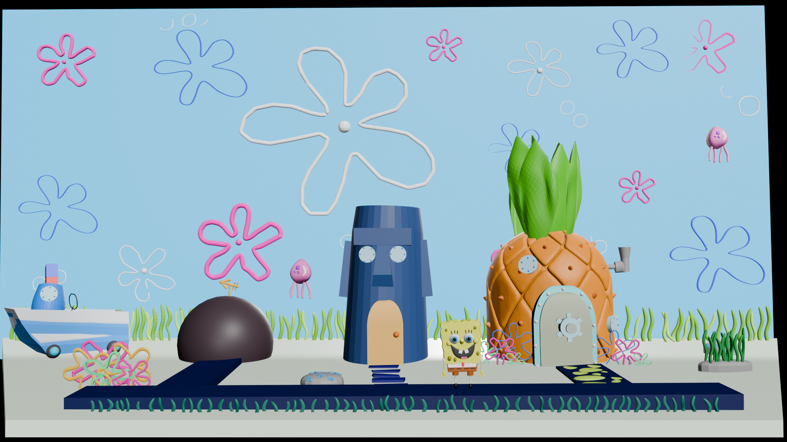
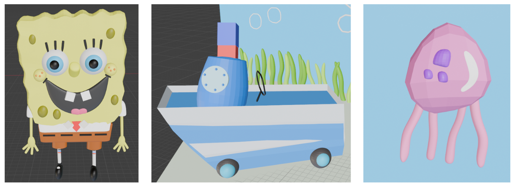
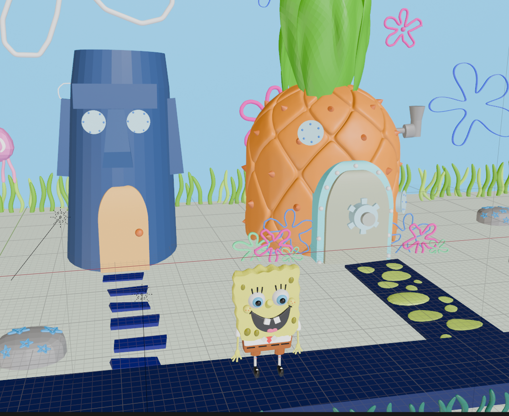

# Interpretação de Desenhos Infantis com Técnicas de Computação Gráfica: Uma Abordagem sobre o Universo de Bob Esponja  

  
  
  

## 🎯 Objetivo do Projeto  
Este projeto tem como objetivo construir o desenho “Bob Esponja Calça Quadrada” utilizando técnicas de Computação Gráfica, recriando de forma tridimensional e interativa o cenário da Fenda do Biquíni.  

O trabalho foi dividido em duas partes principais:
1. Modelagem 3D dos elementos no *Blender** (casas, cenário e personagem);  
2. Renderização e movimentação interativa no **Unity**, incluindo animações e controle de objetos pelo teclado.

O documento completo (`.tex`/PDF) está incluído no repositório e contém uma descrição detalhada das etapas, técnicas e desafios enfrentados.

## 🧩 O que foi Construído  

- Modelagem completa das **casas do Bob Esponja, Patrick e Lula Molusco**.  
- Criação de elementos decorativos como **flores, pedras, algas e bolhas**.  
- Construção do **barco** e das **águas-vivas animadas** com movimento independente.  
- Implementação de **movimento interativo** das águas-vivas via teclado no Unity (WASD e IJKL).  
 

## 🖼️ Resultados  

As imagens abaixo mostram parte do resultado final da modelagem e integração:  

   
   
  

## 📄 Documentação  

O arquivo **PDF/LaTeX** incluído neste repositório descreve de forma detalhada:
- Etapas do desenvolvimento;  
- Técnicas de Computação Gráfica utilizadas;  
- Configuração de iluminação, câmera e renderização;  
- Desafios enfrentados e soluções adotadas.  

<h3 style="color: white;">📬 Contato</h3>

  
   

